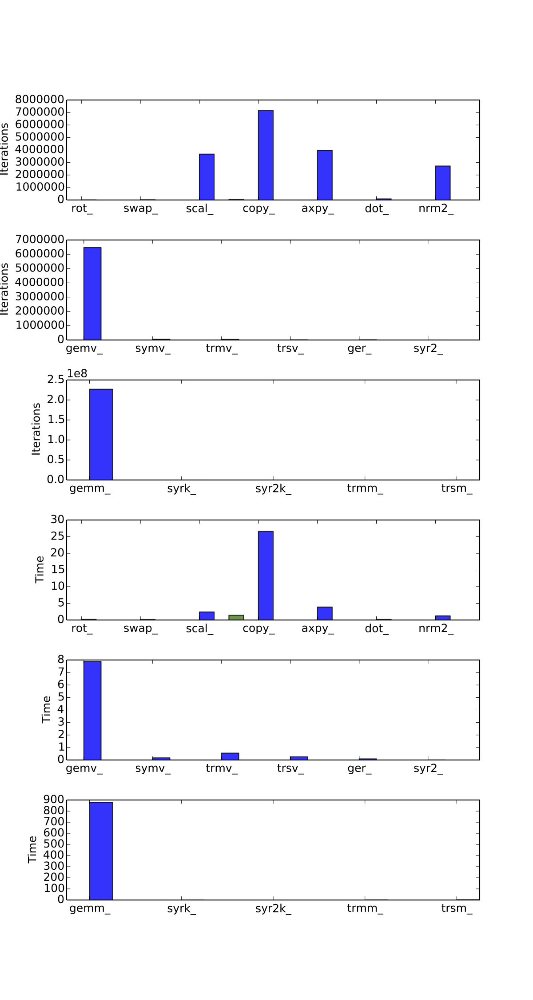
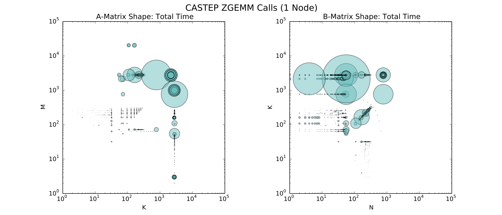
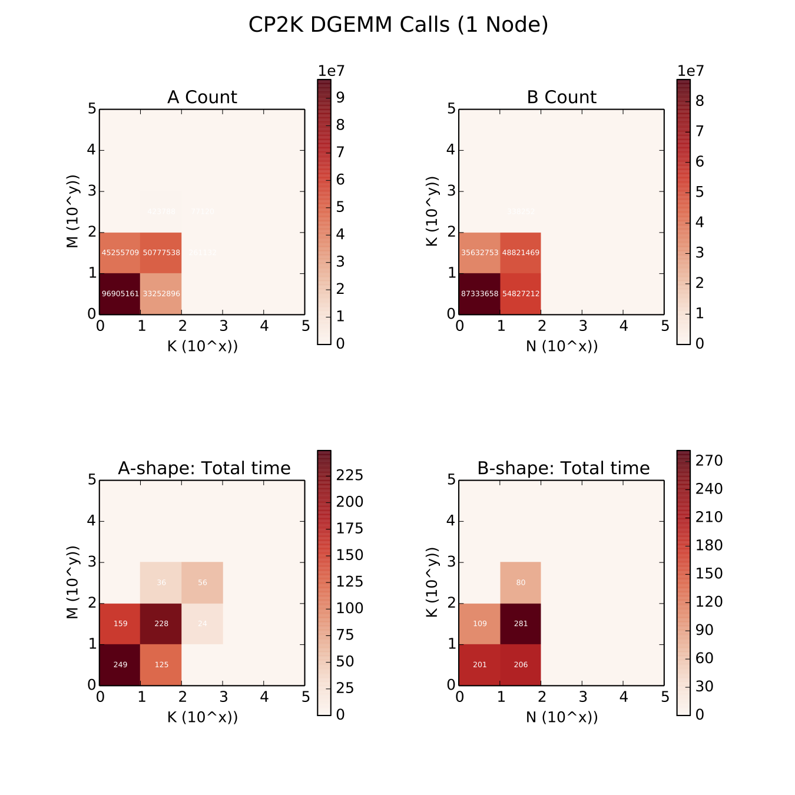

# perf-libs-tools

**Copyright 2017-9 Arm Limited, All rights reserved**

**This tool is adapted from the ARM [perf-libs-tools](https://github.com/ARM-software/perf-libs-tools) tracing tool.** It has been adapted to work with Cray's `scilib` and Intel's `MKL`. It also features a few more python tools for analysing the generated log files.

## Contents

1. [Compiling](#compiling)
2. [Usage](#usage)
3. [Tools](#tools)
    - [Overall Library Usage](#Overall-Library-Usage)
    - [Generate BLAS Usage Plot](#Generate-BLAS-Usage-Plot)
    - [Create GEMM Summaries](#Create-GEMM-Summaries)
      - [Create GEMM Scatter Graph](#Create-GEMM-Scatter-Graph)
      - [Create GEMM Heat Map](#Create-?GEMM-Heat-Map)
4. [Known Issues](#Known-Issues)
5. [Licensing](#Licensing)
    


## Compiling 

### Build ARMPL Tracer

1. Ensure that you are using the latest version of the logging library to match 
   your build of Arm Performance Libraries.  This version matches 19.3.

2. From the top level directory type `make armpl`.

You should now have created both "lib/libarmpl-summarylog.so" and "lib/libarmpl-memlightlog.so".

### Build ARMPL Tracer with LibMath

1. Ensure that you are using the latest version of the logging library to match 
   your build of Arm Performance Libraries.  This version matches 19.3.

2. From the top level directory type `make armpl-math`.

You should now have created a "lib/libarmpl-math-summarylog.so" and "lib/libarmpl-math-memlightlog.so".

### Build Generic BLAS+LAPACK+FFT Tracer

1. From the top level directory type `make generic`.

You should now have created a "lib/generic-summarylog.so" and "lib/generic-memlightlog.so".

**Note:** The tracer has not currently been tested with other FFT libraries


## Usage

1. Use LD_PRELOAD to pick-up the newly created logging library:
  ```shell
  export LD_PRELOAD=$PWD/lib/<tracer>.so
  ```

2. When you are building your application ensure that you are linking in 
   the shared library (e.g. libarmpl_lp64_mp.so)
   rather than the static library (e.g. libarmpl_lp64_mp.a).

3. Run your application as normal.  Output files will be produced in the /tmp/
   directory when the program completes.  These will be called 
   /tmp/armplsummary_<pid>.apl where <pid> is the process ID. The root of this can be modified by setting
  the environment variable ARMPL_SUMMARY_FILEROOT before running the application.
   
## Output

The output files generated list the following information:

`"Routine:" <routine name> "nCalls:" <call count> "Mean_time" <call mean time> "nUserCalls:" <top level call count>	 "Mean_user_time:" <mean time top-level> "Inputs:" input parameters to routine, integers then characters`

That is, at the end of the execution of a program a summary list is produced 
itemizing each of the routines called, detailing the input cases that it has 
been called with, and then calculating the mean time taken for those inputs.

Only the integer and character parameters are recorded in this output.

## Tools

In the `tools/` directory are some example scripts to produce graphical summaries 
of the output produced from the logging library.  They are written using the 
Python package MatPlotLib, and we recommend running the visualization part of 
that script on a local machine rather than on a remote box.

At present we are seeing these as a two-stage process:
1.  process the /tmp/armplsummary_<pid>.apl output 
2.  visualize this output

To use any of the analysis tools, move into the `tools/` directory.

### Overall Library Usage

#### Command

```shell
python process_summary.py <input files>
```

#### What does it do?
This produces information about all library calls made.  A high-level 
summary is returned, folllowed by break-downs of all the calls to each 
library component (BLAS, LAPACK, FFT).  This data is split into output
summarising both the total of calls and time spent in the function, and 
also the number and time spent in this function from just user-called 
invocations.
     
For FFT calls this data also matches planning and execution stages 
enabling detailed profliing of fftw_execute() calls with only a pointer.

An additional file, `/tmp/armpl.blas`, generated is the BLAS summary data, which can be fed into `./blas_usage.py`.
    
#### Example

```shell
python process_summary.py /tmp/armplsummary_*.apl 
```

#### Output
```
Opening file ../1/cp2k-scale-1_log32006.apl
Opening file ../1/cp2k-scale-1_log32007.apl
Opening file ../1/cp2k-scale-1_log32008.apl
BLAS level 1     : count   17851227    total time      36.3302  user count    7389635  user time      29.5862
BLAS level 2     : count    6603582    total time       8.9482  user count     571902  user time       2.4728
BLAS level 3     : count  227055761    total time     884.4104  user count  226979665  user time     880.0860
LAPACK           : count 3515618744    total time    1374.7935  user count 3508362809  user time    1326.6120
FFT              : count       4864    total time       2.8585  user count       4352  user time       2.7934

BLAS cases:
----------
BLAS level 1:
  dcopy_     cnt=    7157004  totTime=      26.5762   called_tot=    4662156  topTime=      24.9084    (%age of runtime:  0.200 )
...
BLAS level 3:
  dgemm_     cnt=  226963200  totTime=     879.6574   called_tot=  226926656  topTime=     878.1235    (%age of runtime:  7.066 )
...
LAPACK cases:
----------
cbrt     cnt=  232733483  totTime=      97.2629 called_tot=  232733483  topTime=      97.2629    (%age of runtime:  0.783 )
...
```

### Generate BLAS Usage Plot

#### Command
```shell
python blas_usage.py [-h] [-l] [-n] [-x] -i INFILE -o GRAPH_NAME
# Required arguments:
#  -i INFILE, --input INFILE   Input file
#  -o GRAPH_NAME,              File name for graph
# Optional arguments:
#  -h, --help                  Show help message and exit
#  -l, --legend                Show graph legend
#  -n, --normalize             Normalize bars to percentages of max
#  -x, --exclude               Exclude unrepresented functions
```

#### What does it do?

This visualizes the data from an armpl.blas file generated by 'process_summary.py'.

Two sets of three rows of bar charts:
  - Top set: Number of calls
  - Bottom set: Time spent in these calls
  
For each set:
  - Top row:    BLAS level 1 routines
  - Middle row: BLAS level 2 routines
  - Bottom row: BLAS level 3 routines

On each row different families of functions are shown, for example GEMM.
For each family different bars show the number of routines of:
  - single precision real (red)
  - double precision real (blue)
  - single precision complex (yellow)
  - double precision complex (green)

#### Example

```shell
python blas_usage.py -x -i /tmp/armpl.blas -o blas_usage
```

#### Output



[Example Graph](tools/EXAMPLES/example_blas_usage.png )


### Create GEMM Summaries

#### Command

```shell
cd perf-libs-tools
make tools/Process-dgemm
cd tools

./process-dgemm.sh <input files>
```

#### What does it do?

This produces summary information about ?GEMM calls made in an application.

#### Example

```shell
./process-dgemm.sh /tmp/armplsummary_*.apl 
```

#### Output

Two files:
 - `/tmp/armpl_scatter.<?gemm>`
 - `/tmp/armpl.<?gemm>`

### Create GEMM Scatter Graph


#### Command

```shell
dgemm_scatter.py [-h] [-t] -o GRAPH_NAME -i INFILE [-l]
# Required arguments:
#  -i INFILE, --input INFILE  Input file
#  -o GRAPH_NAME,             File name for graph
# Optional arguments:
#  -h, --help                 Show help message and exit
#  -t                         Graph title
#  -l, --legend               Show graph legend
```

#### What it does?

This visualizes the data from an `armpl_scatter.?gemm` file.

#### Example

```shell
python dgemm_scatter.py -i "/tmp/armpl_scatter.zgemm"  -o "example_zgemm_scatter" -t "CASTEP ZGEMM Calls (1 Node)"
```

#### Output



[Example Graph](tools/EXAMPLES/example_zgemm_scatter.png )


### Create GEMM Heat Map

#### Command

```shell
heat_dgemm.py [-h] [-t] -o GRAPH_NAME -i INFILE [-l]
# Required arguments:
#  -i INFILE, --input INFILE  Input file
#  -o GRAPH_NAME,             File name for graph
# Optional arguments:
#  -h, --help                 Show help message and exit
#  -t                         Graph title
#  -l, --legend               Show graph legend
```

#### What it does?

This visualizes the data from an `armpl.?gemm file`.

#### Example

```shell
python heat_dgemm.py -i "/tmp/armpl.zgemm"  -o "example_dgemm_heat" -t "CP2K DGEMM Calls (1 Node)"
```

#### Output



[Example Graph](tools/EXAMPLES/example_dgemm_heat.png )


## Known issues

- For certain codes that create extortionate numbers of FFTW plans then it may 
  be necessary to prevent trying to match plans with executes.  This situation 
  would result in a significant, and worsening, run-time performance of the 
  application.  This is not detailed here, but instructions can be made 
  available upon request.

## Licensing

This project is distributed under an Apache 2.0 license, available in the file
LICENSE.  All inbound contributions will also be under this same licence.